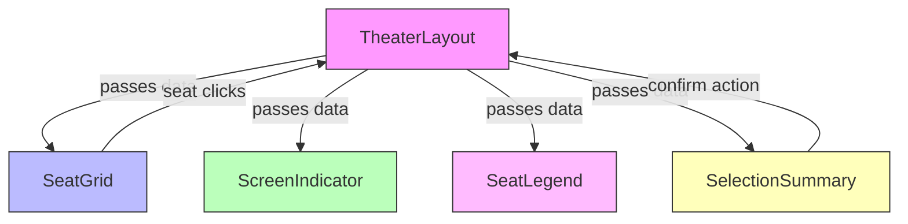

# Theater Seat Selection System Documentation

## Overview

This system provides a complete theater seat selection interface with the following components:

- Seat layout generation
- Interactive seat grid
- Screen indicator
- Seat legend
- Selection summary
- Booking functionality

## Table of Contents

1. [Data Structure](#data-structure)
2. [Helper Functions](#helper-functions)
3. [Main Components](#main-components)
   - [TheaterLayout](#theaterlayout)
   - [SeatGrid](#seatgrid)
   - [ScreenIndicator](#screenindicator)
   - [SeatLegend](#seatlegend)
   - [SelectionSummary](#selectionsummary)
4. [Utility Functions](#utility-functions)
5. [Flow Diagram](#flow-diagram)

---

## Data Structure

### TheaterData

```typescript
interface TheaterData {
  id: string;
  name: string;
  screen: {
    id: string;
    name: string;
  };
  showtime: {
    id: string;
    startTime: string;
    endTime: string;
  };
  seatLayout: SeatLayout;
}
```

### SeatLayout

```typescript
interface SeatLayout {
  rows: number;
  columns: number;
  rowLabels: string[];
  columnLabels: number[];
  categories: {
    id: string;
    name: string;
    color: string;
    price: number;
  }[];
  seats: Seat[][];
}
```

### Seat

```typescript
interface Seat {
  id: string;
  row: number;
  column: number;
  rowLabel: string;
  columnLabel: number;
  status: SeatStatus;
  categoryId: string;
  price: number;
  isAisle: boolean;
}
```

### SeatStatus (Enum)

```typescript
enum SeatStatus {
  AVAILABLE = "available",
  BOOKED = "booked",
  BLOCKED = "blocked",
  NOT_A_SEAT = "not_a_seat",
}
```

---

## Helper Functions

### `generateSeatLayout()`

Generates a realistic theater seat layout with:

- 10 rows (A-K, skipping I)
- 15 columns
- Aisles after columns 3 and 12
- Premium seats (first 3 rows)
- Standard seats (remaining rows)
- Random booked seats (10% chance + specific patterns)

**Code Flow:**

1. Initialize empty layout array
2. Loop through row labels (A-K)
3. For each row:
   - Create 15 columns
   - Mark columns 3 and 12 as aisles
   - Set premium/standard category based on row
   - Apply booking patterns
   - Push seat objects to row array
4. Push each row to layout array
5. Return complete layout

---

## Main Components

### TheaterLayout

The main container component that orchestrates all other components.

#### Props

```typescript
interface TheaterLayoutProps {
  theaterData: SeatLayout;
  maxSelectableSeats: number;
  onSelectionConfirm: (seats: Seat[]) => void;
}
```

#### State

- `selectedSeats`: Array of currently selected seats
- `validationError`: Current error message (if any)

#### Key Functions

1. `handleSeatClick(seat: Seat)`

   - Toggles seat selection
   - Handles max seat limit validation
   - Updates selected seats state

2. `handleConfirmSelection()`
   - Validates at least one seat is selected
   - Calls `onSelectionConfirm` with selected seats

#### Component Structure

- Renders all child components
- Manages state and passes data down
- Handles user interactions

---

### SeatGrid

Displays the interactive seat layout.

#### Props

```typescript
interface SeatGridProps {
  seatData: Seat[][];
  selectedSeats: Seat[];
  onSeatClick: (seat: Seat) => void;
}
```

#### Key Functions

1. `isSeatSelected(seatId: string)`

   - Checks if seat is in selectedSeats array

2. `getSeatClasses(seat: Seat)`
   - Returns appropriate CSS classes based on:
     - Seat status
     - Category
     - Selection state
     - Aisle status

#### Component Structure

- Column headers (numbers)
- Row labels (letters)
- Seat grid with clickable seats
- Visual representation of aisles

---

### ScreenIndicator

Visual representation of the theater screen.

#### Props

None

#### Component Structure

- Gradient rectangle with "Screen" label
- Shadow effect below
- Instructional text

---

### SeatLegend

Visual key explaining seat colors and statuses.

#### Props

None

#### Component Structure

- Four legend items:
  1. Premium seats
  2. Standard seats
  3. Selected seats
  4. Unavailable seats

Each item shows:

- Colored square
- Label
- Price (where applicable)

---

### SelectionSummary

Displays current selection and booking controls.

#### Props

```typescript
interface SelectionSummaryProps {
  selectedSeats: Seat[];
  onConfirm: () => void;
  maxSeats: number;
}
```

#### Key Functions

1. `getCategoryBreakdown(selectedSeats: Seat[])`
   - Groups seats by category
   - Calculates counts and totals

#### Component Structure

- Selected seats count
- List of selected seat IDs
- Price breakdown by category
- Total price
- Back/Proceed buttons

---

## Utility Functions

### `getCurrentSelection()`

Returns currently selected seats (stub implementation)

### `lockSeat(seatId: string)`

Simulates seat locking (5 minute expiry)

### `unlockSeat(seatId: string)`

Simulates seat unlocking

### `verifyBooking(seatIds: string[])`

Simulates booking verification

---

## Flow Diagram



## Usage Example

```typescript
import TheaterLayout from "./TheaterLayout";
import { theaterData } from "./theaterData";

function App() {
  const handleConfirm = (seats: Seat[]) => {
    console.log("Confirmed seats:", seats);
    // Proceed to payment
  };

  return (
    <TheaterLayout
      theaterData={theaterData}
      maxSelectableSeats={6}
      onSelectionConfirm={handleConfirm}
    />
  );
}
```

---

## State Management Details

### Selection State Flow

1. **Initial State**:

   - `selectedSeats`: Empty array
   - `validationError`: null

2. **Seat Selection**:

   ```mermaid
   sequenceDiagram
       User->>SeatGrid: Clicks available seat
       SeatGrid->>TheaterLayout: Calls handleSeatClick()
       TheaterLayout->>TheaterLayout: Updates selectedSeats state
       TheaterLayout->>SeatGrid: Re-renders with new selection
   ```

3. **Validation Rules**:
   - Max seats enforced in `handleSeatClick`
   - Minimum seats enforced in `handleConfirmSelection`

### Persistence Considerations

- Current implementation is in-memory only
- Production implementation would:
  - Sync with backend via API calls
  - Use session storage for temporary persistence
  - Implement seat locking mechanism

---

## Error Handling

### Validation Scenarios

1. **Max Seats Reached**:

   - Message: "You can select a maximum of X seats"
   - Trigger: When attempting to select beyond maxSelectableSeats

2. **No Seats Selected**:

   - Message: "Please select at least one seat"
   - Trigger: When clicking confirm with empty selection

3. **Seat Conflict**:
   - Message: "Some seats are no longer available: [seat list]"
   - Trigger: During booking verification (stub implementation)

### Error Display

- Rendered in red banner above selection summary
- Auto-dismissed on next valid action
- Accessible via ARIA live region

---

## Accessibility Considerations

### ARIA Attributes

- **SeatGrid**:
  ```jsx
  role="grid"
  aria-label="Theater seating chart"
  ```
- **Individual Seats**:
  ```jsx
  role="gridcell"
  aria-label={`${status} seat ${rowLabel}${columnLabel}`}
  aria-disabled={status !== SeatStatus.AVAILABLE}
  ```

### Keyboard Navigation

1. **Tab Sequence**:
   - Seat grid → Legend → Back button → Proceed button
2. **Grid Navigation**:
   - Arrow keys move between seats
   - Enter/space toggles selection

### Color Contrast

- Meets WCAG AA standards:
  - Premium seats: Yellow-100 on Yellow-800
  - Standard seats: Blue-100 on Blue-800
  - Selected seats: White on Green-500

---

## Performance Optimizations

### Memoization

```typescript
// In SelectionSummary:
const totalPrice = useMemo(() => {...}, [selectedSeats]);
const formattedSeats = useMemo(() => {...}, [selectedSeats]);
```

### Virtualization

- For large theaters (>20 rows), consider:
  ```jsx
  import { FixedSizeGrid as Grid } from "react-window";
  ```

### Rendering Optimizations

- SeatGrid uses React.memo
- Pure component for ScreenIndicator
- Memoized category breakdown calculations

---

## Testing Strategy

### Unit Tests

1. **generateSeatLayout()**:

   - Verifies correct seat count
   - Checks aisle placement
   - Validates premium/standard distribution

2. **SeatGrid**:
   - Renders correct rows/columns
   - Handles click events properly
   - Displays correct seat states
